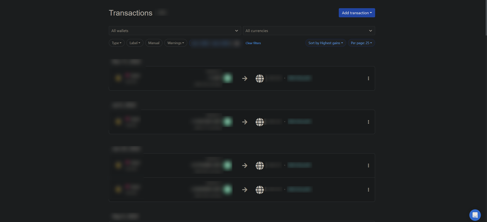
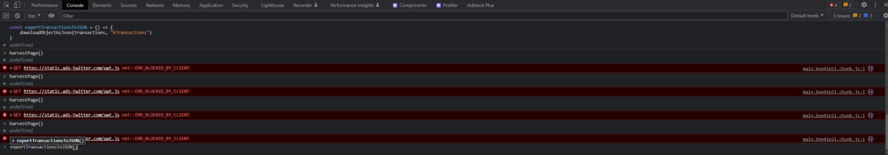

# KoinlyScrape

A collection of scripts, used for scraping transaction info from Koinly.

## Use guide
1. Go to the Transactions tab in Koinly, choose your filters (recommended to sort by "Highest gains, 25 per page")

2. Copy the contents of "koinlyScript.js" in the "script/" directory
3. Open the developer console in the Koinly browser tab
4. Paste all functions from the file to the console, change the currency if needed from the FIAT_VALUE_KEY variable (row 12, default is BGN) and press enter

5. Type "harvestPage()" in the console and execute for every page with net profit/loss transactions. This will save the cost basis, fiat value received and net profit/loss in the console memory. While doing this don't refresh the page, as all data and functions will be deleted from the console.

6. To export the gathered transactions, execute "exportTransactionsToJSON()" in the console (this doesn't clear the saved transactions) The JSON can be easily converted to a .csv or .xlsx with online tools (might implement it as a function in the future)

7. To clear all script functions and variables, as mentioned, simply refresh or close the browser page.
